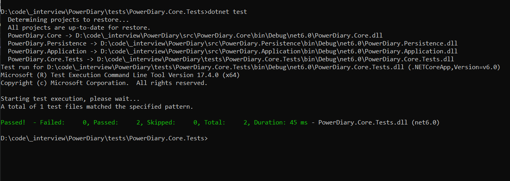

# PowerDiary Backend Coding Challenge

This is PowerDiary developer assessment.

If you are reading this, you most probably have been asked to complete this assessment as part of PowerDiary Technical challenge on interview process.

In this repository, you will find the base project and instructions on what to do with them. 

## How to complete this test

Please follow the instructions you got on email

Please explain the work that you did or any challenges that you faced, either by comments in code or in an email.


## Goal
 With this exercise we would like to understand how you would think about and solve a task for production at any given day. 


## Todo
- [X] Add Tests
- [X] Add Demo 

## System Requirements
1. Visual Studio 2022 to open and debug the code
2. .net 6 installed to run the code.

## Instructions
1. Unzip the project  
2. Navigate to the folder in project path from the **command line**
3. Run command
    ```csharp
   dotnet restore
   ```
4. Run 
   ```csharp
   dotnet build
   ```
5. To .\tests\PowerDiary.Core.Tests\ the project, 
   ```csharp
   dotnet test
   ```
    
   
6. To run
   ```csharp
   dotnet run
   ```
7. Navigate to "\src\PowerDiary.Console\bin\Debug\net6.0\" from command line
   ```csharp
    PowerDiary.Console.exe -palindrome=sqrrqabccbatudefggfedvwhijkllkjihxymnnmzpop  
  
    PowerDiary.Console.exe -palindrome=aaa  
  
    
   ```


## Demo

Check out the demo project for a quick example of how it works.


## Contact

Adem Gashi - [@ademg](https://linkedin.com/in/ademg) - adem888@gmail.com